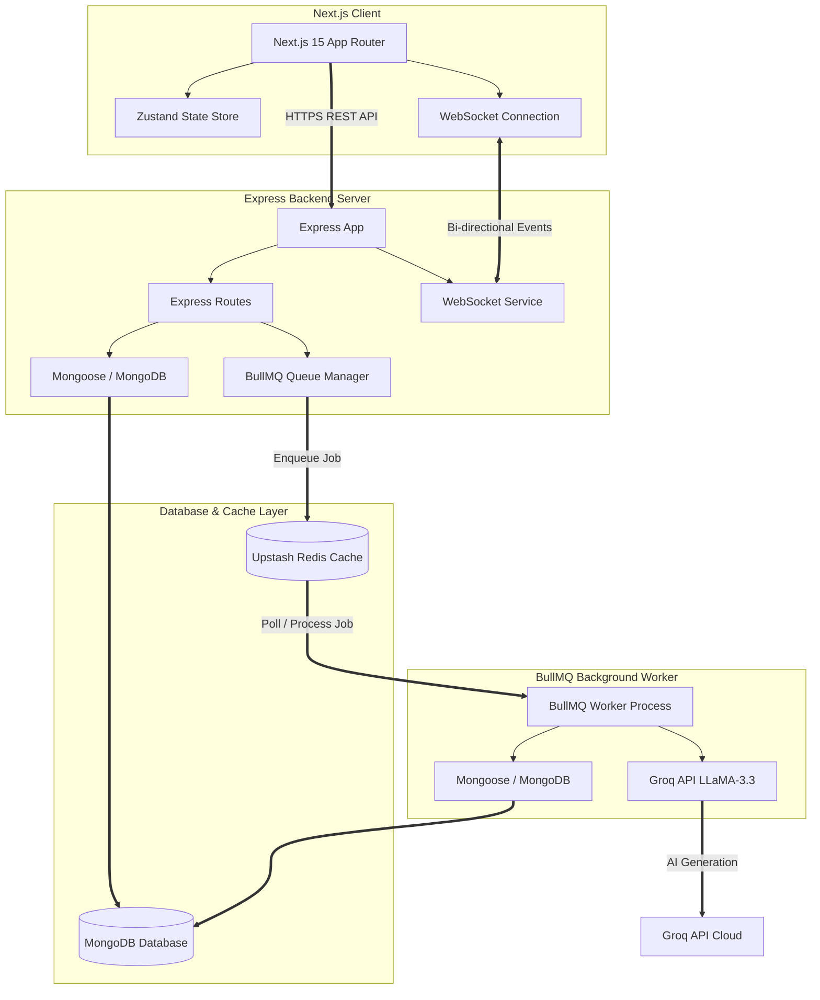

# VedaAI — AI-Powered Assessment Creator

VedaAI is a premium, state-of-the-art fullstack web application designed for educators, teachers, and schools to effortlessly create, customize, and generate premium school question papers and assignments in seconds using advanced generative AI.

---

## 🏛️ Architecture Overview

VedaAI is structured as a decoupled, event-driven multi-tier application with high performance, robustness, and visual elegance at its core.



### 1. Frontend Architecture
* **Framework:** Next.js 15 (App Router) with React 19 and TailwindCSS v4.
* **State Management:** **Zustand** is utilized for clean, lightweight state management. It houses dynamic form variables, ongoing generations, real-time sync progression percentages, and general UI configurations.
* **Real-time Engine:** Standard WebSockets are implemented directly inside custom client hooks. The frontend establishes a live channel (`ws://localhost:3000`) with the backend to receive real-time execution events.
* **Document Rendering:** Leverages `@react-pdf/renderer` for on-demand high-fidelity PDF exports of generated assignments and answer keys.

### 2. Backend API Layer
* **Runtime & Language:** Node.js with TypeScript and Express.
* **Database Object Modeling (ODM):** Mongoose maps TypeScript interfaces directly to robust MongoDB Atlas or local MongoDB collection schemas.
* **Job Delegation (BullMQ):** Instead of processing intensive LLM generations inside the HTTP request-response cycle (which results in server timeouts and a degraded user experience), the API places requests onto a BullMQ Redis-backed message queue and immediately returns a `202 Accepted` status with the job details.

### 3. Background Queue & Worker
* **Message Broker:** Upstash Redis hosts the BullMQ message queue.
* **Worker Daemon (`src/worker.ts`):** A standalone worker thread processes AI generation tasks asynchronously.
* **Generative Engine (`groqService`):** Orchestrates interactions with Groq's high-speed API utilizing `llama-3.3-70b-versatile` to formulate structured JSON assessment questions matching specified formats (MCQs, Short/Long answers, diagrammatic prompts, numerical problems, etc.) and complete grading rubrics / answer keys.
* **Real-time Dispatcher (`wsService`):** Broadcasts progress notifications (`job:progress` @ 25%, 60%, 90%) and status indicators (`job:processing`, `job:done`, `job:failed`) back to the browser.

---

## 🚀 The Technical Approach

### 1. Asynchronous Task Queue Pattern (BullMQ & Redis)
High-performance generative AI APIs can take several seconds to stream or formulate complete responses. 
* **The Problem:** Processing this directly inside an Express route blocks server event loops and risks gateway timeouts (e.g., Nginx/Heroku 30s limits).
* **The Solution:** We adopt an asynchronous job processing workflow. 
  1. An Express request creates an `Assignment` in the database with status `queued`.
  2. The request is pushed into the `questionGeneration` BullMQ queue.
  3. The API replies instantly to the client.
  4. The worker processes the queue sequentially, ensuring system resilience and predictable concurrency.

### 2. Dual-Engine Generation (Production AI vs. Robust Local Mocking)
To ensure high developer and application reliability out of the box:
* **The Groq Pipeline:** When `GROQ_API_KEY` is fully provisioned, the backend generates questions using a strict schema prompt with structural validation.
* **Robust Mock Engine:** If no API credentials are provided or they are missing in the `.env`, the service seamlessly switches to a highly descriptive mock generation pipeline. The mock engine mimics realistic questions (varying by section, question types, difficulty levels, and grading distributions) and includes matching answer keys, ensuring the UI flow never crashes.

### 3. Event-Driven Real-time Synchronization (WebSockets)
Instead of forcing the client to repeatedly poll `/api/assignments/:id` for updates (which stresses database CPU and network bandwidth), we leverage WebSockets:
* A unified server-wide WebSocket Manager broadcasts changes cleanly.
* When the BullMQ worker changes states (`processing` ➡️ `progress` ➡️ `done`), it fires low-overhead JSON payloads.
* The frontend Zustand store intercepts these packets, updating the progress bar and UI with micro-animations instantly.

### 4. Schema-First Design and Unified Types
Both the backend database schemas (`Assignment.ts`) and the frontend representation types align perfectly under strict TypeScript typing. This guarantees contract reliability, eliminating runtime undefined-variable issues during structural rendering.

---

## 📂 Repository Structure

```
veda_ai/
├── Backend/
│   ├── src/
│   │   ├── config/         # Database, Redis & environment setups
│   │   ├── controllers/    # Express routing logic handlers
│   │   ├── models/         # Mongoose Schema Definitions (MongoDB)
│   │   ├── routes/         # Express endpoint configurations
│   │   ├── services/       # Groq AI SDK, BullMQ Queue, WebSockets
│   │   ├── types/          # Core TypeScript Interfaces
│   │   ├── index.ts        # Primary API bootstrap process
│   │   └── worker.ts       # BullMQ Worker background processing unit
│   ├── .env                # Backend server configurations
│   └── tsconfig.json
│
└── Frontend/
    ├── src/
    │   ├── app/            # Next.js App Router Pages and Layouts
    │   ├── components/     # High-fidelity visual React components
    │   ├── hooks/          # Real-time WebSocket hook hooks
    │   ├── lib/            # Axios API Clients
    │   ├── store/          # Zustand State Stores
    │   └── types/          # Shared TypeScript configurations
    ├── .env                # Frontend environment configurations
    └── package.json
```

---

## ⚙️ Getting Started & Local Setup

### 📋 Prerequisites
* **Node.js** (v18 or higher recommended)
* **MongoDB** (Running locally on `127.0.0.1:27017` or MongoDB Atlas cluster connection string)
* **Redis** (Used for BullMQ background queues. E.g., via Upstash or local Redis server)

---

### 1. Backend Setup
1. Navigate to the `Backend` directory:
   ```bash
   cd Backend
   ```
2. Install the backend dependencies:
   ```bash
   npm install
   ```
3. Configure your local environment variables in `Backend/.env`:
   ```env
   PORT=3000
   MONGODB_URI=mongodb://127.0.0.1:27017/veda_ai
   UPSTASH_REDIS_HOST=your-upstash-host.upstash.io
   UPSTASH_REDIS_PORT=6379
   UPSTASH_REDIS_PASSWORD=your-upstash-password
   GROQ_API_KEY=your-groq-api-key
   ```
4. Start the Express API server and WebSocket server:
   ```bash
   npm run dev
   ```
5. *(In a separate terminal)* Start the BullMQ background worker daemon:
   ```bash
   npm run dev:worker
   ```

---

### 2. Frontend Setup
1. Navigate to the `Frontend` directory:
   ```bash
   cd ../Frontend
   ```
2. Install the client dependencies:
   ```bash
   npm install
   ```
3. Configure your frontend environment variables in `Frontend/.env`:
   ```env
   NEXT_PUBLIC_API_URL=http://localhost:3000
   NEXT_PUBLIC_WS_URL=ws://localhost:3000
   ```
4. Spin up the Next.js development client using Turbopack:
   ```bash
   npm run dev
   ```
5. Open your browser and navigate to `http://localhost:3000` to start creating premium assessments!

---

## ✨ Features Checklist
- [x] **Dynamic Multi-Section Configuration**: Add as many sections (MCQ, Short, Essay, etc.) as required with custom grading structures.
- [x] **Real-time Queueing & Progress UI**: Watch the AI compile your question papers via elegant visual progression metrics.
- [x] **Beautiful Document Interface**: View structured question papers and separate step-by-step grading guides directly inside the premium dashboard.
- [x] **Export to PDF**: Single-click high-performance PDF outputs with curated typographic alignments.
- [x] **Local DB fallbacks**: Resilient system architecture that functions even when external cloud components are offline.
